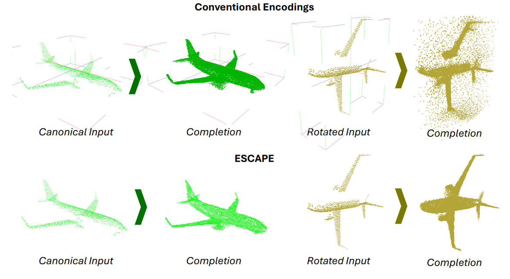
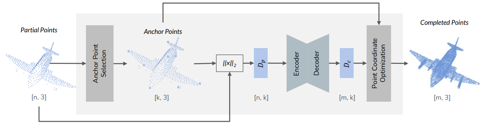

# ESCAPE: Equivariant Shape Completion via Anchor Point Encoding (CVPR 2025)

Implementation of the paper [ESCAPE: Equivariant Shape Completion via Anchor Point Encoding](https://arxiv.org/abs/2412.00952).


[Burak Bekci](), [Mahdi Saleh](https://scholar.google.com/citations?user=52yLUy0AAAAJ&hl=en), [Dr. Federico Tombari](https://scholar.google.com/citations?user=TFsE4BIAAAAJ&hl=en), [Prof. Dr. Nassir Navab](https://scholar.google.de/citations?user=kzoVUPYAAAAJ&hl=de)




ESCAPE (Equivariant Shape Completion via Anchor Point Encoding), a novel framework designed
to achieve rotation-equivariant shape completion. Our approach employs a distinctive encoding strategy by selecting anchor points from a shape and representing all points as
a distance to all anchor points. This enables the model to capture a consistent, rotation-equivariant understanding of the object’s geometry. ESCAPE leverages a transformer
architecture to encode and decode the distance transformations, ensuring that generated shape completions remain accurate and equivariant under rotational transformations.
Subsequently, we perform optimization to calculate the predicted shapes from the encodings. Experimental evaluations demonstrate that ESCAPE achieves robust, high-quality reconstructions across arbitrary rotations and translations, showcasing its effectiveness in real-world applications without additional pose estimation modules.




## Installation

### Requirements

The code is tested with below versions
```
CUDA 11.3
Python 3.8
PyTorch 1.11
```


Install required libraries with the following command:
```
bash scripts\install.sh
```

Once everything is installed the training can be started with:

```
python train.py 
```

To evaluate run:

```
python eval.py 
```

## Datasets

Download dataset from below sources:

* [PCN](https://gateway.infinitescript.com/s/ShapeNetCompletion)
* [KITTI](https://drive.google.com/drive/folders/1N3IhVq5p1qNBUnyZCtPmxSEl98Stx4Jf)
* [OmniObject3D](https://drive.google.com/drive/u/0/folders/1-hlkTqUJR_J2xht1qztmX2xAq_qNw4vn)

For OmniObject3D there is a reference [notebook file](omniobject\OmniObjectRenderBlenderImages.ipynb) for creating the dataset containing partial and complete point clouds.


## Trained Models

Trained models will be released soon.


## Acknowledgements

Some parts of the code is borrowed from below repositories:

* [PoinTr](https://github.com/yuxumin/PoinTr/tree/master)
* [Seedformer](https://github.com/hrzhou2/seedformer)
* [Snowflake](https://github.com/AllenXiangX/SnowflakeNet)
* [Chamfer distance for higher dimensions](https://github.com/otaheri/chamfer_distance)
